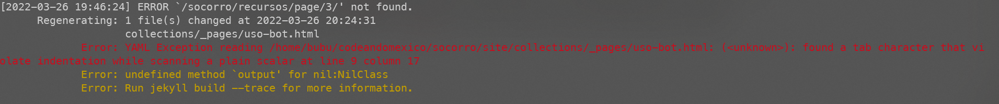

<!-- # Vonge

Vonge is a Personal portfolio/blog site template for Jekyll. Browse through a [live demo](https://jazzed-kale.cloudvent.net/).
Increase the web presence of your brand with this configurable theme.



Vonge was made by [CloudCannon](http://cloudcannon.com/), the JAMStack Cloud CMS.
The component library is built and maintained for use with [Bookshop](https://github.com/cloudcannon/bookshop/)

Find more templates, themes and step-by-step Jekyll tutorials at [CloudCannon Community](https://cloudcannon.com/community/).

[](https://app.cloudcannon.com/register#sites/connect/github/CloudCannon/vonge-jekyll-bookshop-template) -->
# ¿Qué es Socorro Bot?

Lorem ipsum dolor sit amet, consectetur adipiscing elit. Praesent lobortis bibendum ullamcorper. Ut at hendrerit orci, quis sodales leo. Nunc pharetra imperdiet libero nec cursus. Curabitur rutrum fringilla dolor, at iaculis urna hendrerit id. Nam ornare augue in erat consectetur interdum. Donec cursus bibendum ipsum, vitae ornare ipsum vehicula at. Aliquam sodales nunc in rhoncus suscipit. Suspendisse fermentum purus vel neque vestibulum pellentesque. Vivamus nec dui non lacus suscipit laoreet. Aliquam vehicula euismod mauris, eget bibendum leo condimentum vel. Phasellus eget lectus quis velit vehicula hendrerit. Nullam at augue euismod, ultrices est eget, vestibulum augue. Fusce non arcu tortor.

# Requisitos

- **nodeJs** 16.0.0+
- **npm** 8.0.0+
- **bundler** 2.0.0
- **jekyll** 4.0.0+

Para editar y configurar el sitio, es probable que necesites el conocimiento básico de `**HTML**` `**JavaScript`** y **`SCSS`**. Puesto que gran parte del código y los archivos se basan en eso.  Además, como gran plus y debo decir casi necesario, tienes que saber lo básico de `Jekyll` y como funciona su sistema de carpetas.

# Pasos para correr en local

1. Abrir terminal y clonar el repositorio 

```bash
$ git clone https://gitlab.com/CodeandoMexico/socorro.git
```

1. Acceder al proyecto

```bash
$ cd socorro
```

1. Instalar dependencias

```bash
$ npm install
$ npm run install-jekyll
```

1. Correr el sitio 

```bash
$ npm start
```

1. Para este punto tu servidor local estará corriendo, puedes acceder a él a través de cualquier navegador en este link: `http://127.0.0.1:6060/socorro/`.
2. Para cerrar el servidor, simplemente presiona `Ctr + C` en tu terminal.

# ¿Cómo actualizar la página en GitLab Pages?

Al hacer `npm start` se genera una carpeta llamada `_site` en el root del proyecto, esta carpeta es la página estática que subiremos a la rama de GitLab Pages, y las instrucciones para que sea desplegada se encuentran en el archivo `.gitlab-ci.yml` ahí encontraras el siguiente texto:

```bash
pages:
  stage: deploy
  script:
  - mkdir .public
  - cp -r _site/* .public
  - mv .public public
  artifacts:
    paths:
    - public
  only:
  - main
```

que básicamente quieren decir que cualquier alteración a la carpeta `_site` se verá reflejada en la [página](https://codeandomexico.gitlab.io/socorro/). Eso significa, que cada que quieras cambiar algo en la página, deberás primero cambiarlo en la carpeta `_site` pero no de manera directa, puesto que al volver a construir el proyecto con `npm start` los cambios que hayas hecho sobre `_site` se eliminarán y se re-generará la carpeta, más adelante en la sección de **Módulos** discutiremos cómo puedes entonces hacer cambios de manera correcta y de manera permanente. Por el momento, ten en cuenta que para modificar la página lo mejor que puedes hacer es modificar, agregar cosas o borrar cosas de la carpeta `site`, y luego hacer `npm start`.

# Componentes

En esta sección se aclarará para qué sirve cada carpeta importante y cómo puedes agregar elementos, editarlos o eliminarlos. Esta plantilla se basa en la idea de **componentes**, cada cosa que está en cada vista de la página se puede entender como componentes, esto es, pedazos de código en `HTML` y `CSS` que puedes simplemente mandar a llamar y se generarán en la página, algunos ejemplos de componentes son:

- Botones
- Cajas de texto
- Cajas de texto con imágenes a los lados
- Contenedor para imágenes
- Lista de recursos
- Tablas
- Mapas
- Etc.

Podrás encontrar casi todos los componentes que se utilizan (y los que no) en la dirección `./components/components` de nuestro proyecto, si estás buscando componentes que se repitan en cada página, como el **header** o el **footer**, entonces no las encontrarás en esta carpeta, estas están incluidas dentro de `site`. Cada una de las carpetas que están ahí, representa un componente que se puede utilizar en cualquier vista o página nueva que queramos hacer, dentro de cada una de esas sub-carpetas, podrás notar que existen 3 o 2 archivos (dependiendo del componente), por el momento ignoraremos el archivo con extensión `.toml` puesto que no tiene importancia en nuestro contexto donde corremos todo en local y subimos la página estática al servicio de pages. Los otros dos archivos con extensión `.jekyll.html` y `.scss` representan el `HTML` y `SCSS` del componente, es decir, son el cómo están hechos, por ejemplo, analicemos un componente, por ejemplo, un botón (archivo `./components/components/button`): 

```html
<a class="c-button c-button--{{include.type | slugify}} c-button--{{include.width | slugify | default: 'small'}}"
   href="{{ include.link_url }}"
   
        target="_blank"
    >
    {{ include.label }}
</a>
```

como podrás observar, esto se parece mucho a la sintaxis de `HTML` y la verdad es que es exactamente igual excepto por ciertos bloques que empiezan con el carácter `{` y terminan con `}`. Esto es parte de la sintaxis de `Liquid` que nos permite agregar lógica a nuestro `HTML` plano, es prácticamente transformar `HTML` a un lenguaje de programación con lógica y otras funcionalidades, como bloques `if else` o `for` loops, también variables y pipes de lógica, puedes aprender más de este lenguaje en el [siguiente link](https://shopify.github.io/liquid/basics/introduction/). También observa que se accede a una variable llamada `include` que parece no estar declarada en ningún lado, esto es porque `include` es la variable en donde pasamos toda la información que necesitamos a nuestro componente, recuerda que necesitamos usar los componentes en cualquier lado, por lo tanto necesitamos que sean lo más genéricos posibles, para que, por ejemplo, podamos poner un botón que diga `Hola` y otro botón que diga `Adios`, en ese caso lo que hacemos es crear un botón general que reciba en su variable `include` alguna propiedad como texto, booleano o números, en este caso, esta propiedad de texto se llama `label` y la podemos llamar con `include.label`. Los estilos correspondientes a este componente están en el archivo junto al `HTML` con el mismo nombre escrito completamente en `SCSS` que hace más sencillo escribir `CSS`, si quieres saber más puedes dar click [aquí](https://sass-lang.com/). 

Cabe mencionar que dentro de la carpeta de componentes existen un par de carpetas más, llamadas `bookshop` y `shared`, sobre el primero no hay mucho que decir excepto que no la toques, pero es importante saber que los estilos compartidos, es decir, los estilos que no pertenecen a ningún componente en específico y son para elementos en general (o para componentes recurrentes), como el body, las listas o las tablas, están en la carpeta `shared`. Si estás buscando dónde están los estilos del **footer** y **header** esta es la carpeta en la que los encontrarás, dentro de `components/shared/styles/03-modules` están ambos estilos.

## Crear un nuevo componente

Para crear un nuevo componente es necesario que crees una carpeta dentro de `./components/components` llamada como sea que quieras que se llame el componente, digamos que queremos crear un componente que tenga texto y una imagen y que se llama `content-with-image` (este ya existe), entonces lo que debemos de hacer es crear una carpeta llamada de esta manera y dos archivos llamados exactamente igual que la carpeta que acabamos de crear, uno con extensión `.jekyll.html` y el otro con extensión `.scss` y siguiente el mismo patrón  de diseño que tienen todos los demás componentes puedes crear el tuyo también, tienes que tener cuidado con los nombres de clases en el `HTML` y `CSS` puesto que si tratas de usar una clase que ya existe y la estás sobrescribiendo en este componente, puede causar problemas con los otros componentes. Te recomiendo crear tus propias clases y ponerles un patrón en común para diferenciar cuáles son los tuyos, por ejemplo, les puedes poner `bubu-content-with-image` de nombre de clase y así ahorrarte problemas con los demás componentes.

# Site

En esta carpeta es en donde estaremos construyendo el sitio de manera directa, suponiendo que ya tienes todos los componentes que necesitas para empezar a construir tu página, entonces tienes que entender el sistema de carpetas dentro de `site`.

- ***data:*** Contiene archivos `.yml` donde existe información que se accede a través de los componentes o includes con la variable reservada `site.data.<nombre_de_archivo>`.
- ***_includes:*** Contiene archivos `.html` que conforman cierto tipo especial de componentes, por ejemplo, los componentes que existen en todas las vistas de nuestra página, por ejemplo, el header y el footer, también hay otros componentes pero honestamente no se exploran tan claro en nuestro caso.
- ***_layouts:*** Estos son los tipos de vista que se pueden tener en nuestra página, es exactamente lo mismo que la carpeta de `_layouts` en cualquier otra plantilla de `jekyll`.
- ***assets: [No tocar]*** Es una carpeta que permite la traducción de `SCSS` a `CSS` normal.
- ***collections:*** Aquí hay cosas más específicas de nuestro proyecto, cada una de las carpetas ahí, representa una colección de elementos que usamos dentro del sitio:
    - En la carpeta `_pages` están todas las vistas de nuestra página, la sección de `amparos`, la sección de `colectivos`, etc... Cualquier sección que tengamos en nuestra página, tendrá que tener un archivo relacionado dentro de esta carpeta con el nombre que queramos, es decir, si queremos tener un entrada en nuestro sitio llamado `metodologia` de tal manera que se pueda acceder a ella con el siguiente URL [`https://<nombre_del_dominio>/socorro/metodologia/`](https://codeandomexico.gitlab.io/socorro/metodologia/), entonces debemos de crear un archivo `html` dentro de la carpeta `_pages` que se llame `metodologia.html` y adentro escribir cómo queremos formar esta página (eso se verá más adelante en **Crear vistas nuevas**). La única excepción a la regla es el `index.html` que se accede a través de la página sin ningún tipo de path.
    - En la carpeta `_posts` están almacenados los recursos con extensión `.markdown` con el siguiente formato `AAAA-MM-DD-nombre-del-recurso.markdown` donde esa fecha es la fecha de actualización del recurso, es decir, cuándo fue agregado. Por favor, note que se la carpeta se llama `_posts` y no `_recursos` esto fue por conveniencia de poder usar la plantilla sin ninguna complicación, pero ten en cuenta que en todos lados donde dice **post** en nuestra página significa **recurso** (Yo sé que esta no es la mejor práctica, una disculpa, pero no me la quise complicar mucho, además, es bastante sencillo una vez cambias la palabra recurso por post).
    - En `_testimonials` están los colectivos, y esto es exactamente igual que `_posts` pero en lugar de llamarse `_colectivos` se llaman `_testimonials`. También aquí debes de tener en cuenta lo que se mencionó en el punto anterior, no quise complicarme mucho y solo usé la plantilla de testimonios para nuestro caso de uso que es colectivos, mientras sigas el formato todo debería de salir bien.
- ***images:*** Todas las imágenes de nuestro proyecto están aquí.
- ***js:*** Todos los scripts de JavaScript están aquí.
- Y luego hay archivos que sirven igual que en una plantilla normal de `jekyll` como el `_config.yml` o los `Gemfiles`. En esto no ahondaré puesto que no necesitas tocar nada de esto para usar la plantilla, pero si llegas a tocar el archivo de configuración, tendrás que reiniciar el server (`npm start`).

# **Crear vistas nuevas**

Para crear distintas páginas dentro de nuestro sitio (por ejemplo, el apartado de metodología, o el apartado de acerca de) necesitamos crear un archivo con extensión `.html` dentro de la ruta `./site/collections/_pages` con el nombre que aparecerá en el path de la ruta que queremos acceder (ejemplo en la sección de **Site**). Este archivo deberá tener un Front Matter muy específico (Front Matter tiene que ver con Jekyll y su sistema de plantillas) y en general no deberá de tener cuerpo (aunque en algunos archivos se usa para colocar alguna dependencia de algún archivo de JavaScript). Tomaré como ejemplo el `uso-bot.html` que corresponde con la vista de la página que explica el uso del bot:

```yaml
---
title: ¿Cómo usar el bot?
content_blocks:
  - _bookshop_name: page-heading-with-image
    title: ¿Cómo usar el bot?
    image: "images/flow.png"
    alt: "Flujo del bot"
  - _bookshop_name: content-with-image
    separation: true
    title: Instrucciones
    description_html: >-
      1. Lorem ipsum dolor sit amet, consectetur adipiscing elit.Lorem ipsum dolor sit amet, consectetur adipiscing elit.Lorem ipsum dolor sit amet, consectetu.Lorem ipsum dolor sit amet, consectetur adipiscing elit.olor sit amet, consectetu.
    image: "images/flow.png"
  - _bookshop_name: content-with-image
    separation: true
    title: Instrucciones
    description_html: >-
      2. Lorem ipsum dolor sit amet, consectetur adipiscing elit.Lorem ipsum dolor sit amet, consectetur adipiscing elit.Lorem ipsum dolor sit amet, consectetu.Lorem ipsum dolor sit amet, consectetur adipiscing elit.olor sit amet, consectetu.
    image: "images/flow.png"
---
```

Para empezar podrán ver que existe una variable llamada `title` que corresponde al título de la etiqueta del navegador, luego lo más importante `content_blocks` que es una variable que guarda una lista de componentes, estos son los componentes que existen en la carpeta `components`. Para agregar un componente a nuestra página debemos de usar la variable `_bookshop_name:`  seguido del nombre del componente que queramos añadir, y abajo debemos poner todos los parámetros que este componente pueda recibir, por ejemplo, el primer componente que es `page-heading-with-image` puede recibir `title` `image` y `alt`. Estos parámetros son importantes porque son los que toma nuestro componente con la variable `include`. Hay parámetros obligatorios y otros opcionales, pero estos dependen de la estructura de nuestro componente, y tendrás que experimentar con esto un buen rato hasta que le encuentres la lógica. También cabe mencionar que se puede pasar HTML a través de parámetros con el operador especial `>-`.

**ALGO MUY IMPORTANTE SOBRE ESTO:** El Front Matter, no admite **tabuladores,** es decir, si trabajas en un ambiente como **Vscode** que formatea el código por ti, ten cuidado de que no coloque tabuladores, o sino, tu código no correrá y recibirás un alerta roja y amarilla parecida a esta:


Espero que no tengas que colocar los espacios a mano como yo.

# Mapas, tablas y generación de contenido dinámico: